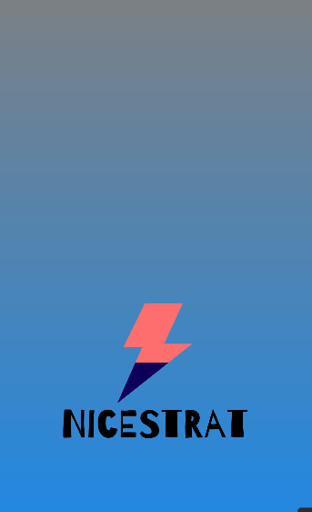

# Nombre del Proyecto

NiceStrart

## Descripción

Este proyecto es una aplicación Android creada con Java en Android Studio. Permite a los usuarios registrarse e iniciar sesión, además de ofrecer una interfaz principal para interactuar con diversas funcionalidades
mas adelante incorporaremos nuevas mejoras a lo largo del tiempo

## Requisitos

- JDK 11 o superior (recomendado según configuración del proyecto).
- Android Studio (obligatorio para abrir y ejecutar el proyecto).

## Estructura del Proyecto

A continuación hare una breve descripcion de la estructura principal del proyecto:

- `src/main/java/SingUp.java` - Código fuente para la funcionalidad de registro de nuevos usuarios
- `src/main/java/Login.java` - Código fuente para la pantalla de inicio de sesión
- `src/main/java/MainActivity.java` - Codigo fuente para la vista principal de la aplicacion
- `src/main/res/layout/activity_login.xml` - Layout para la pantalla de inicio de sesión
- `src/main/res/layout/activity_main.xml` - Layout para la vista principal de la aplicacion
- `src/main/res/layout/activity_sing_up.xml` - Layout para la pantalla de registro de usuarios
- `src/main/AndroidManifest.xml` - Archivo de configuracion del proyecto

## Capturas de Pantalla

A continuación, se presentan algunas capturas de pantalla de como se verian las pantallas principales de la aplicación:

### Registro
Esta es nuestra pantalla de registro

### Inicio de Sesión
Esta es la pantalla en la cual realizamos el login a la aplicaion 

### Vista Principal
Este seria el main de nuestra aplicacion

### Pantalla de Carga
Esta es la pantalla de carga de la aplicacion al inicializarla 

