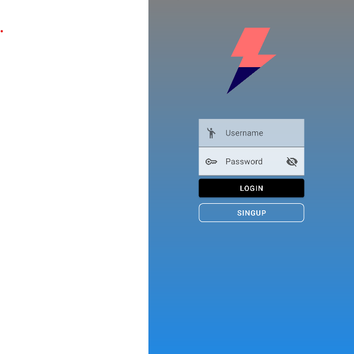
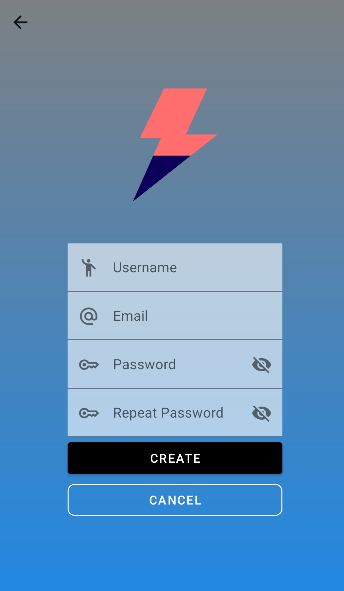
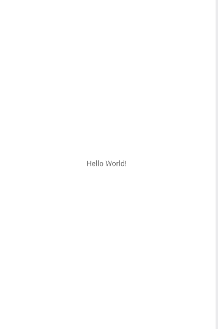

## Descripción

Aquí se encuentran el código de nuestro (Java), los recursos (layouts, drawables, valores),  
Todo esto para dar acabo nuestra aplicacion`NiceStrat`.

- `src/main/java/SingUp.java` - código fuente del backend de la ventana asociada al inicio de una cuenta nueva.

- `src/main/java/Login.java` - código fuente del backend de la ventana en la cual iniciamos sesion.

- `src/main/java/MainActivity.java` - Aqui tenemos el código fuente del backend de la foto que vemos a continuacion.

## Requisitos del programa 

- JDK (11+ recomendado, según configuración del proyecto).
- Android Studio (obligatorio).

## Estructura 

- `src/main/java/Login.java` - código fuente del backend de la ventana asociada al inicio de sesion.
- `src/main/java/MainActivity.java` - código fuente del backend de la vista principal.
- `src/main/java/SingUp.java` - código fuente del backend de la ventana asociada al registro de una cuenta nueva.
- `src/main/res/layout/activity_login.xml` - Aqui se encuentra el codigo del frontent de la ventana asociada al inicio de sesion.
- `src/main/res/layout/activity_main.xml` - Aqui se encuentra el codigo del frontent de la vista principal.
- `src/main/res/layout/activity_sing_up.xml` - Aqui se encuentra el codigo del frontent de la ventana asociada al registro de una cuenta nueva.
- `src/main/AndroidManifest.xml` - manifest del módulo.

## Cómo contribuir

1. Crea un branch con un nombre descriptivo (por ejemplo `feature/nombre` o `fix/descripcion`).
2. Abre un Pull Request hacia la rama destino (ej. `develop` o `main`) con una descripción clara de los cambios.
4. Incluye screenshots o pasos para reproducir si el cambio afecta la UI.
